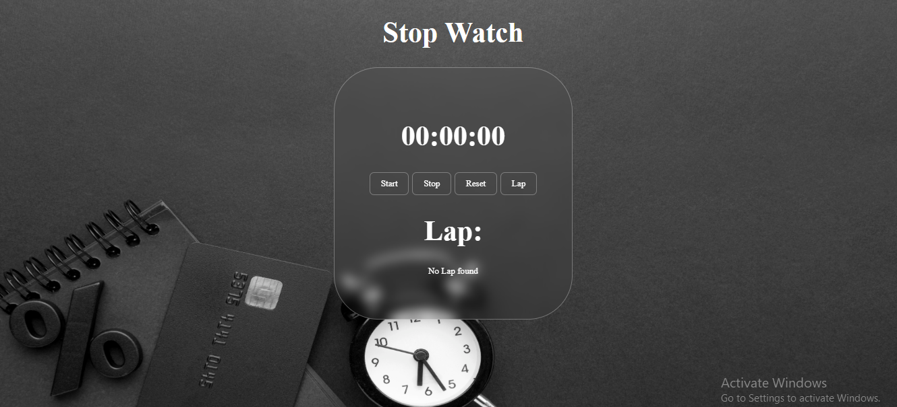

# ⏱️ React Stopwatch App

A clean and responsive **Stopwatch Application** built with ReactJS, designed to track time with precision.  

---

## ✨ Features

✔️ **Start** — Begin time tracking  
✔️ **Stop** — Pause the timer  
✔️ **Reset** — Reset the timer to 00:00  
✔️ **Lap** — Record lap times  

---

## 🖼️ Screenshot

<p align="center">
  
</p>

---

## 🛠️ Technologies Used

- ⚛️ **ReactJS**  
- 🎨 **CSS**  
- ✨ **JavaScript (ES6)**  

---

## 🚀 How to Run

1. Make sure **Node.js** and **npm** are installed  
2. Clone the repository  

```bash
git clone https://github.com/Majidali90121/Stopwatch-App.git  
cd Stopwatch-App  
npm install  
npm start  


## 📂 Project Structure

Stopwatch-App/ <br/>
├── public/ <br/>
│   ├── index.html <br/>
│   
├── src/ <br/>
│   ├── App.js <br/>
│   ├── App.css <br/>
│   ├── Stopwatch.js <br/>
│   └── index.js <br/>
├── package.json <br/>
└── README.md <br/>


---

## 📬 Contact

For feedback, suggestions, or improvements, feel free to connect! 🚀  

---
